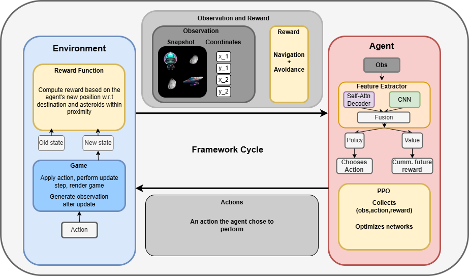

# RescueAI
RescueAI is an AI agent trained with Proximal Policy Optimization (PPO) using a custom actor-critic architecture for processing multimodal observations. Leveraging curriculum learning, the agent is trained through a series of checkpoints, gradually increasing the difficulty of the task and complexity of the environment. The final agent is capable of navigating in a randomized 2D space environment where it's tasked to carry a lost alien back to its mothership while avoiding any collisions with floating asteroids.

## Highlights
<div style="text-align: center;">  </div>

## Inference
Clone the repository and open the console:
```
conda create --name RescueAI
conda activate RescueAI
pip install -r requirements.txt
python3 rescue_ai.py
```

# The road to RescueAI
The following provides a deeper dive to understand how RescueAI was developed.

## Mathematical Foundation

RescueAI is learnt by applying the Proximal Policy Optimization (PPO) algorithm. For a deeper dive, please check out: [[PPO Paper](https://arxiv.org/pdf/1707.06347),
[PPO Explained](https://www.youtube.com/watch?v=5P7I-xPq8u8)].

Brief summary:
### Clipped Policy Objective


$$\mathcal{L}^{CLIP}(\theta) = \mathbb{E}_t \left[ \min \left( r_t(\theta) \hat{A}_t, \text{clip}(r_t(\theta), 1 - \epsilon, 1 + \epsilon) \hat{A}_t \right) \right]$$
The main idea behind the clipped policy objective is avoiding too aggressive updates by clipping, or bounding how much the new policy can differ from the old one.\
The key takeaways:
$$r_t(\theta) = \frac{\pi_\theta(a_t|s_t)}{\pi_{\theta_{old}}(a_t|s_t)}$$
Is the change in probability of picking $a_t$ in state $s_t$ under the new policy.
$$\hat A_{t} = R_{t} - V(s_t;\theta)$$
Is the advantage estimate, given by the difference of the discounted rewards $R_{t}$ and the baseline estimate $V(s_t;\theta)$. It essentially indicates, how much better or worse an action $a_t$ taken in state $s_t$ is compared to the baseline value estimate.
On the bottom line: This helps in guiding the policy update by focusing on improving actions that performed better than expected and discouraging those that performed worse.
### Complete Objective
$$L_{t}^{CLIP + VF + S} =  \mathbb{E}_t \left[ L_{t}^{CLIP}(\theta) + c_1L_{t}^{VF}(\theta) + c_{2}S[\pi_{\theta}](s_t) \right]$$
The combined Loss is the expectation over the clipped policy objective, the penalization for inaccurate return predictions $V(s_t;\theta)$ and an entropy term used to encourage exploration.

## Environment
The environment can be thought of as the playground for the AI agent. It's capable of altering the environment's state by taking actions. The environment in our case is a custom mini game developed by using the [Python Arcade](https://api.arcade.academy/en/latest/) library. It's a 512x512 pixel 2D space game comprising of a rescuer, a spacecraft controlled by the agent, Alfred, the cute alien who got lost in space and a mothership, Alfred's destination. Asteroids are floating through space which destroy the rescuer upon collision. The entire game is randomized, i.e the positions of all starting locations are random, with the exceptions of being none overlapping with each other and the border. The spawning location of the asteroids is on the screen's border and each asteroid is given a random but bounded velocity.

## Task
The agent is tasked to find Alfred and bring him back to the mothership while avoiding to collide with any floating asteroids.

## Observations and Actions
An observation is a refined version of the game state comprising of the essentials required for an agent to fullfill its task. It can be thought of as the information of the game given to the agent. In practice, that information is carefully tailored to the task, the reward function and the feature extractor. \
Actions are essentially the decisions or choices of an agent in response to the current game state, and in the view of the agent, the observation it received.

In our case, the observation at time step $t$ is a tuple: $o_t = (o_1 \in \mathbb{R}^{4},o_2 \in \mathbb{R}^{300 \times 300})$, where $o_1$ is a vector containing the coordinates of the agent's spacecraft and the destination (either Alfred or the mothership) and $o_2$ is a grey scale image of the agent's vicinity. 

The actions are simple movement decisions: $a = \{up, down, left, right\}$ In practice, the policy network predicts a number which is mapped to the actions and hence chooses an element from the set.

## Reward Function
Having learnt about the advantage estimate $\hat A_{t}$, the discounted reward $R_{t}$ and the predicted cummulative reward $V(s_t;\theta)$, we know how important the reward shaping is. It greatly impacts how PPO optimizes our policy, the way our agent picks actions, and hence achieves or fails the desired goal.

My reward function considers two aspects, moving towards the target, that's either Alfred or the mothership and preventing a collision with astroids in close proximity. In order to achieve more stable rewards over time, I apply reward smoothing with a buffer of 10.


$`r_t = \psi\frac{1}{2}(r_{nav}(o_t,a_t) + \bar{r}_{nav}(o_t,a_t)) + \psi\frac{1}{2}(r_{avoid}(o_t,a_t) + \bar{r}_{avoid}(o_t,a_t))`$


where $r_{nav} = ||rescuer_{pos} - target_{pos}||_{2}$, the eucledian distance between the current and desired position in the plane, while $\bar{r}_{nav}$ is the averaged navigation reward of the past 10 time steps. The constant $\psi$ is a hyperparameter to adjust the magnitude (and thus importance) of the navigation reward. The avoidance reward is formulated similarly, where I compute the euclidean distance between the hit-box mesh of the rescuer and asteroid sprites. 

## Multimodal feature extraction
Recall, the observation comprises of a coordinate vector and an image of the agent's vicinity. Both parts are intended for different aspects. While the coordinate vector provides the information for the pick up and delivery and thus long term navigation, the image harbours the information about asteroids within close proximity and is suitable for learning to avoid collision. In order to laverage this information, we have to build a custom feature extractor which manages to extract information from both modalities.
On a high level, the custom feature extractor can be formulated as follows:

$$features = fusion(Decoder(o_1),CNN(o_2))$$

where the Decoder is a self-attention Transformer Decoder and the CNN comprises of several 2D convolutional and max-pooling layers. Implementation details can be found in 'ppo_model.py'.

## Curriculum Learning
Curriculum Learning is the process of training an AI agent in stages, incrementally increasing the difficulty of the task and possibly the complexity of the environment.

#### Movement Checkpoint
The agent learnt from the coordinate observation how to navigate the 2D plane. So far, asteroids have not been introduced and the screen size was 448x448 pixles, thus it was a smaller environment. Trained until it showed satisfying performance in long term navigation.

#### Asteroid Checkpoint #1-3
Over the course of these checkpoints, the environment was made bigger and asteroids were introduced. The speed and number of the asteroids was increased step-by-step. Most importantly, the parameters of the Decoder were frozen, thus only the CNN's parameters were updated. More about pitfalls in the 'Pitfalls' section.

## Project Overview
<div style="text-align: center;">  </div>

## Evaluation
The following evaluation depicts the performance of the Agent's latest checkpoint against the random baseline. The random baseline is essentially an agent who was not allowed to learn, thus gives a suitable lower bound performance. The evaluation has been conducted by granting each agent 50'000 actions. The velocity of the asteroids was set to high and the number to 4. Which is equivalent to the training parameters for the last checkpoint. Note, the environment is randomized, hence test is different from training.

<div style="display: flex; justify-content: center;">
  <table border="1">
    <thead>
      <tr>
        <th></th>
        <th>Random Baseline</th>
        <th>Rescue AI</th>
      </tr>
    </thead>
    <tbody>
      <tr>
        <th>Runs</th>
        <td>184</td>
        <td>389</td>
      </tr>
      <tr>
        <th>Success chance per run</th>
        <td>8.1%</td>
        <td>62.7%</td>
      </tr>
    </tbody>
  </table>
</div>

## Author
Jeremy Marbach\
12/05/2024

## References
[SB3](https://stable-baselines3.readthedocs.io/en/master/)\
[Python Arcade](https://api.arcade.academy/en/latest/)\
[PPO Paper](https://arxiv.org/pdf/1707.06347)\
[PPO Explained](https://www.youtube.com/watch?v=5P7I-xPq8u8)


